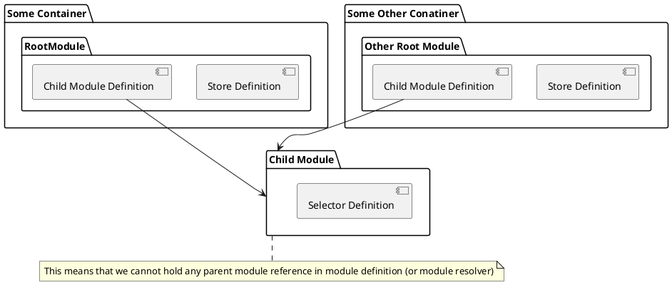

- instantiate `container`
- `container.get(childModule)` - Error, because parent module haven't been loaded yet
- if we store parent reference on a module during creation (`.define('childModule')`) then we may hold references to
modules which even are not required by the container (two containers in single app diagram)
- therefore, in order to use lazy loading we need to manually load (`container.load`) any parent modules ?? 
